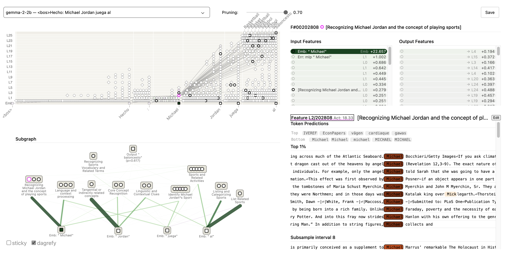
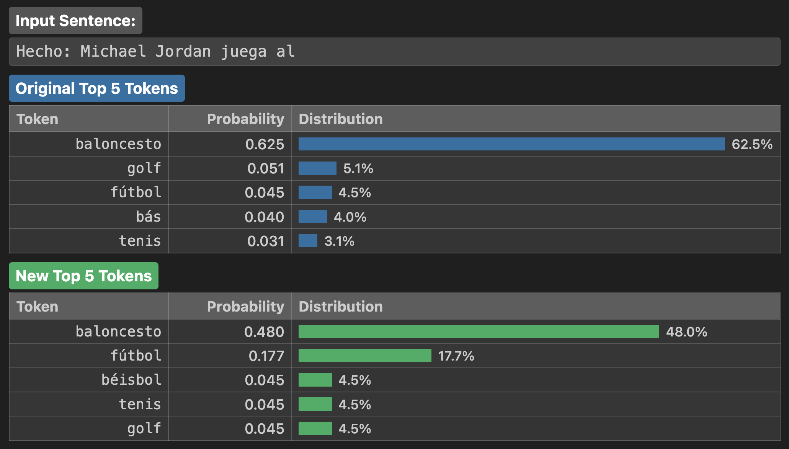

## LLM Interpret Agent

An LLM-powered agent designed to streamline and enhance the process of discovering and analyzing prominent computational circuits within large language models, leveraging the [circuit-tracer](https://github.com/safety-research/circuit-tracer).


### Setting Up

#### Set up the project folder

```
git clone https://github.com/vedpatwardhan/llm-interpret-agent.git
cd llm-interpret-agent
uv venv
uv sync
git submodule update --init
cd circuit-tracer
mkdir graph_files
cp graph-metadata.json circuit-tracer/graph_files
uv pip install -e circuit_tracer
```

#### Generate graph from Neuronpedia

Go to [Neuronpedia](https://www.neuronpedia.org/), generate a new graph or use an existing graph, and download the json for it into the `circuit-tracer/graph_files` folder (through the `Graph Info` option).

Then copy over the "metadata" in the downloaded json to the `circuit-tracer/graph_files/graph-metadata.json` as a list item under `"graphs"`.

Start the circuit tracer server,

```
uv run start_server.py
```

#### Set Params for Analysis

In order to do the analysis, you'd need to view the attribution graph for your chosen example through the server.

Then identify the input and output nodes you care about along with the overall goal, and edit the `main.py` with those accordingly (be sure to use the node ids in the format that matches to the `clickedId` in the url after you click it).

#### Run the script

```
uv run main.py
```


### General Idea

1. Select the input and output nodes that we want to analyze, along with the overall goal we're trying to achieve with the analysis.
2. Select the top feature nodes associated with either of the input and output nodes on the influence.
3. Check each such node for its relevance to the input-output behaviour of the model based on the top 1% examples.
4. Recursively break down the nodes into separate groups, directed by their contents and the overall goal we're trying to achieve. After every grouping step, classify the nodes in that group among its sub-groups and iterate on those that still have more than 5 nodes.
5. Generate the url to view the attribution graph with those nodes pinned and grouped.




### Use-Case

1. The first section of [this](https://github.com/safety-research/circuit-tracer/blob/main/demos/intervention_demo.ipynb) example demonstrates how interventions on certain features can vastly affect the output of the model.
2. My goal here was primarily to understand the effect of intervening on nodes involved in recognizing Michael Jordan to understand how much they affect the identification of the sport.
2. I wanted to have a repeatable process to generate those supernodes in order to quickly find more such nodes that would affect the output.
3. Using some of the nodes selected in graph, I was able to significantly reduce the probability of the sport identified (available in the `demo.ipynb`).




### Future Improvements

1. There seems some sort of redundancy where there's other features that hold similar information to the ones intervened but aren't activated at first, so it would be useful to have an iterative process to identify new nodes that demonstrate this behaviour.
2. The agent doesn't have any control over the actual interventions and observe the effects, so end-to-end access to the full process can improve performance further.
